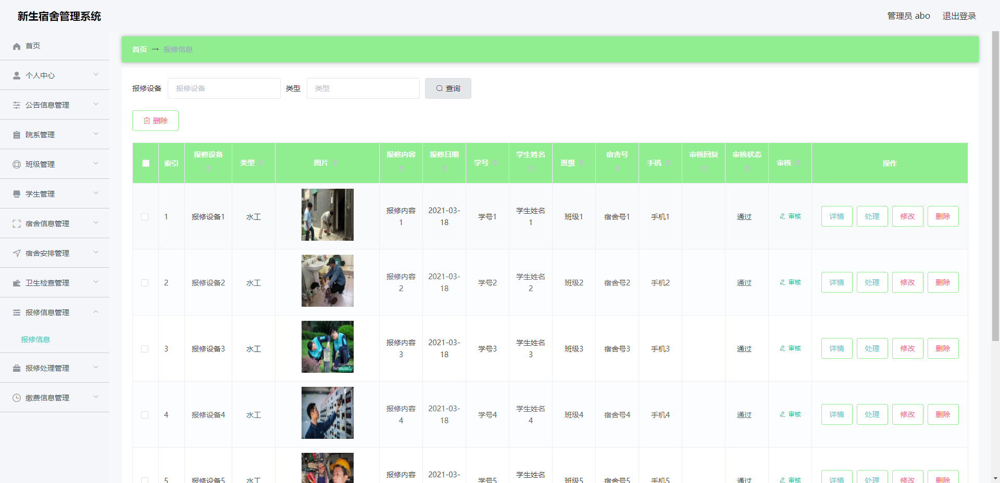

# 1 项目介绍
基于SSM+Vue的新生宿舍管理系统：后端 SpringBoot、Mybatis-Plus，前端Vue+ElementUI，具体功能如下：
## 管理员
- 个人中心：查看和修改个人信息、修改密码
- 公告信息管理
- 院系管理
- 班级管理
- 学生管理
- 宿舍信息管理
- 宿舍安排管理
- 卫生检查管理
- 报修信息管理
- 报修处理管理
- 缴费信息管理

## 学生
- 个人中心：查看和修改个人信息、修改密码
- 公告信息管理
- 宿舍安排管理
- 卫生检查管理
- 报修信息管理
- 报修处理管理
- 缴费信息管理
# 2 系统运行截图
## 2.1 用户登录

## 2.2 公告信息管理

## 2.3 学生管理

## 2.4 报修信息管理

## 2.5 缴费信息管理

## 2.6 宿舍安排管理

## 2.7 卫生检查管理

## 2.8 万字文档

## 2.9 ppt

# 3 数据库设计

# 4 源码数据库获取(收费)

